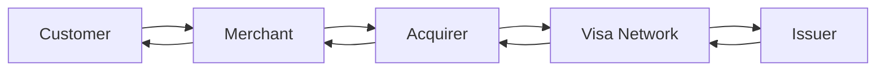

# Start Here

## What This Means

This workspace is built for a complete beginner preparing for a Visa Fullstack Senior Software Engineer interview. You do not need to already know payments, system design, Kafka, or low-level design. The goal is to learn the ideas in simple language first, then practice saying interview-ready answers.

Use this order:

1. Read `Visa and Payments Basics`.
2. Read `Technical Fundamentals`.
3. Practice the `Coding Round`.
4. Study `HLD System Design`.
5. Study `LLD Design`.
6. Prepare `Behavioral and Hiring Manager`.
7. Follow the `7-Day Study Plan`.

## Tiny Example

Imagine a restaurant.

- The customer orders food.
- The waiter takes the request.
- The kitchen prepares it.
- The cashier records payment.
- The manager checks reports at the end of the day.

A software system works similarly. A request moves through parts of a system, each part has a responsibility, and logs/metrics help people understand what happened.

## Visa/Payment Example

For a card payment:

- The customer enters card details.
- The merchant sends a payment request.
- Visa routes the request.
- The issuing bank approves or declines.
- Later, money movement is finalized through clearing and settlement.

## Interview Process Overview

Public candidate reports vary by team, but you should prepare for this pattern:

| Stage | What They Check | Beginner Translation |
|---|---|---|
| Recruiter screen | Role fit, location, work authorization, basics | Can you explain your background clearly? |
| Online assessment | DSA/coding fundamentals | Can you solve medium-style coding problems? |
| Technical coding | Java problem solving and communication | Can you think out loud and test your code? |
| System design | Scalable service design | Can you design APIs, data, components, and failure handling? |
| Behavioral/HM | Ownership, collaboration, judgment | Can you explain your real work and decisions? |

## Beginner Glossary

| Term | Simple Meaning |
|---|---|
| API | A contract that lets one program talk to another. |
| Service | A program responsible for one business capability. |
| Database | Durable storage for data. |
| Cache | Fast temporary storage for frequently used data. |
| Queue | A waiting line for work to be processed later. |
| Transaction | A unit of work that should be handled reliably. |
| Authorization | Approval check for a payment or permission. |
| Clearing | Exchanging transaction details for settlement. |
| Settlement | Final movement of money between parties. |
| Idempotency | Safe retry behavior where duplicate requests do not duplicate the result. |
| Latency | How long one request takes. |
| Throughput | How many requests are handled per second. |
| Availability | Whether the system is usable when people need it. |

## Interview Answer

> I am preparing for Visa by learning payments as a flow of reliable API calls: authorization, capture, clearing, settlement, refunds, and voids. I am also practicing Java coding, REST APIs, databases, Kafka, caching, security, observability, and system design using payment examples.

## Practice Questions

**Q: What is the difference between latency and throughput?**

Latency is the time for one request. Throughput is how many requests the system can handle in a period of time.

**Q: Why do payment systems care about retries?**

Because network calls can fail or time out. A retry should not accidentally charge the customer twice.

**Q: What should you say first in a design interview?**

Ask clarifying questions: users, scale, core features, latency needs, data consistency, security, and failure expectations.

## Common Mistakes

- Memorizing terms without understanding the flow.
- Jumping into code before clarifying requirements.
- Forgetting failure cases, retries, and duplicate requests.
- Talking only about frontend or only about backend for a fullstack role.

## Daily Study Options

| Time | What To Do |
|---|---|
| 30 minutes | Read one concept section and answer 3 practice questions aloud. |
| 60 minutes | Study one concept, solve one coding problem, and explain one resume story. |
| 90 minutes | Do one coding drill, one design drill, and one behavioral answer. |
