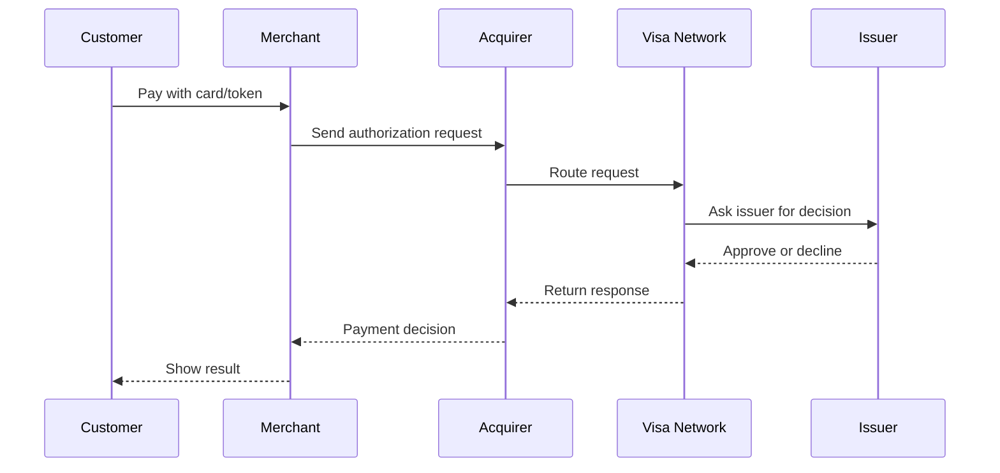
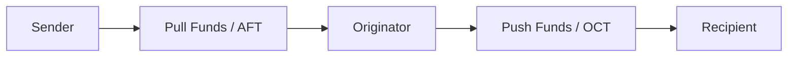
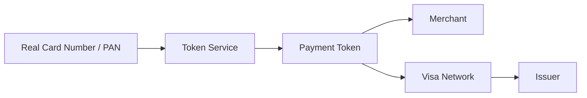

# Visa and Payments Basics

## What This Means

Visa is a global payments network. In an interview, you do not need to know every financial rule, but you should understand the basic players and the movement of a payment request.

The most important idea: a payment is not just "charge card". It is a reliable workflow with approval, recording, risk checks, reversals, and money movement.

## Tiny Example

Think of sending a package.

- Sender gives package to a store.
- Store gives it to a carrier.
- Carrier routes it.
- Destination office accepts or rejects delivery.
- Tracking records every step.

A card payment is similar: a request is routed, approved or declined, and recorded carefully.

## Card Payment Flow

| Player | Plain English Role |
|---|---|
| Customer/Cardholder | Person paying. |
| Merchant | Business accepting payment. |
| Acquirer | Merchant's bank or payment processor. |
| Visa Network | Routes and processes transaction messages. |
| Issuer | Customer's bank or card issuer. |

## Authorization, Capture, Sale, Refund, Void

Visa Payments Processing public docs describe APIs such as Authorization, Capture, Sale, Refund, Void, and Verification for card-not-present processing.

| Operation | Simple Meaning | Easy Example |
|---|---|---|
| Authorization | Ask if payment can be approved. | Hotel checks if your card can cover a room. |
| Capture | Finalize an approved authorization. | Hotel charges when stay is complete. |
| Sale | Authorize and capture together. | You buy a digital product delivered immediately. |
| Refund | Return money after a completed payment. | Merchant refunds returned item. |
| Void | Cancel an authorization or transaction before completion. | Merchant cancels because of timeout or duplicate. |
| Verification | Check account/card information. | Validate account details before use. |

## Visa Direct

Visa Direct is about push payments and funds movement. Public Visa docs describe push payments using Original Credit Transactions, often called OCTs, and pull funding using Account Funding Transactions, often called AFTs.

### Simple Meaning

- **Pull funds:** take money from a funding source.
- **Push funds:** send money to a recipient account.
- **Return funds:** reverse when a push fails.

## Tokenization

Tokenization replaces sensitive card data, such as the Primary Account Number, with a token. The token can look like a card number to backend systems, but it reduces exposure of the real card number.

### Tiny Example

A coat check gives you a ticket instead of letting everyone access the coat room. The ticket represents your coat, but it is not the coat.

### Visa/Payment Example

A mobile wallet may store a payment token instead of the real card number. The token can be limited to a device, merchant, channel, or lifecycle rule.

## Interview Answer

> A payment request starts with a merchant and moves through an acquirer, the Visa network, and the issuer. Authorization asks whether the transaction is approved. Capture and settlement finalize the financial movement later, depending on the flow. For safety, payment systems need idempotency, security, fraud checks, audit logs, and strong observability because timeouts and duplicate requests can affect real money.

## Practice Questions

**Q: What is authorization?**

It is the approval step. The issuer decides whether to approve or decline a payment request.

**Q: What is the difference between refund and void?**

A refund returns money after a completed transaction. A void cancels an outstanding or earlier approved transaction before it fully completes.

**Q: Why is tokenization useful?**

It reduces exposure of the real card number. If a token is compromised, it can be limited or replaced more safely than the actual account number.

**Q: Why do payment systems need audit logs?**

Because teams must explain what happened for customer support, compliance, debugging, and incident response.

## Common Mistakes

- Saying settlement happens immediately for every transaction.
- Treating a payment as one database insert.
- Ignoring declined payments, timeouts, duplicate retries, and reversals.
- Forgetting that security and auditability are core requirements, not extras.
