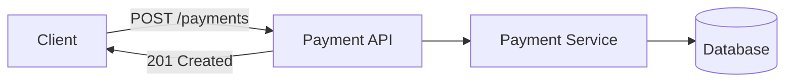
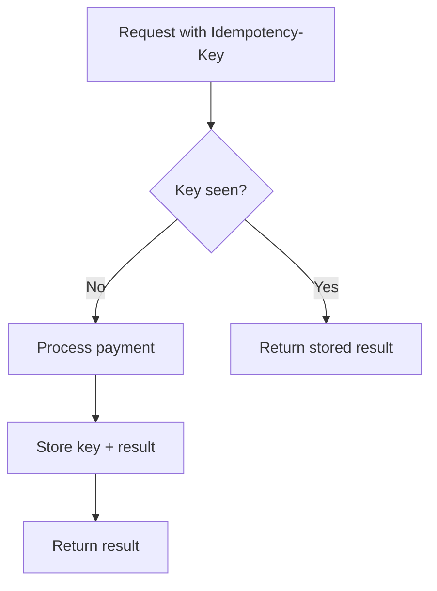
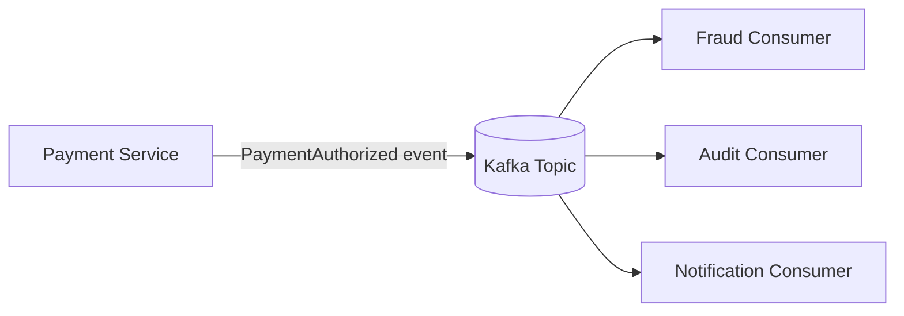
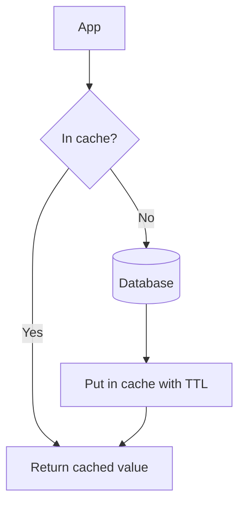

# Technical Fundamentals

## What This Means

This role is fullstack, so you need a practical foundation across frontend, backend, data, security, and operations. You do not need to sound like a textbook. You need to explain how pieces work together in real systems.

## Java Basics

### What This Means

Java is often used for backend services because it is stable, typed, mature, and has strong ecosystem support.

### Tiny Example

A Java class is like a blueprint. An object is a house built from that blueprint.

```java
class Payment {
    String id;
    long amountInCents;
    String status;
}
```

### Must-Know Topics

| Topic | Beginner Meaning | Interview Use |
|---|---|---|
| `ArrayList` | Resizable list | Store ordered items. |
| `HashMap` | Key-value lookup | Count frequencies, cache results. |
| `HashSet` | Unique values | Check duplicates quickly. |
| `Queue` | First-in-first-out | BFS, async work. |
| `PriorityQueue` | Smallest/largest first | Top K, scheduling. |
| Exceptions | Error handling | Validate and fail clearly. |
| Threads | Parallel execution | Handle concurrency carefully. |

## REST APIs

### What This Means

A REST API lets clients send requests over HTTP. The server responds with status, headers, and data.



### Visa/Payment Example

`POST /payments/authorizations` asks for authorization. `POST /payments/{id}/capture` captures a previous authorization.

### Status Codes

| Code | Meaning |
|---|---|
| 200 | OK |
| 201 | Created |
| 400 | Bad request |
| 401 | Not authenticated |
| 403 | Not authorized |
| 404 | Not found |
| 409 | Conflict or duplicate |
| 500 | Server error |

## Idempotency and Retries

### What This Means

Idempotency means the same request can be retried safely without creating duplicate effects.

### Tiny Example

Pressing an elevator button five times should not request five elevators.

### Visa/Payment Example

If `POST /payments` times out, the client retries with the same idempotency key. The server returns the original payment result instead of creating another charge.



## Databases

### SQL vs NoSQL

| Type | Good For | Example |
|---|---|---|
| SQL | Structured data, joins, transactions | PostgreSQL, MySQL |
| NoSQL | Flexible scale or document/key-value access | MongoDB, Cassandra, DynamoDB |

### Indexes

An index is like the index at the back of a book. It helps find data faster, but it costs extra storage and slows some writes.

### Transactions

A database transaction groups changes so they succeed or fail together.

## Kafka and Event-Driven Systems

### What This Means

Kafka is a durable event log. Producers write events. Consumers read them.



### Beginner Vocabulary

| Term | Simple Meaning |
|---|---|
| Producer | Writes events. |
| Consumer | Reads events. |
| Topic | Named stream of events. |
| Partition | Split of a topic for scale. |
| Offset | Consumer position in a partition. |

## Caching

### What This Means

A cache stores frequently used data close to the application so reads are faster.

### Visa/Payment Example

Cache merchant configuration or risk rules so every payment does not need a slow database lookup.

### Common Pattern: Cache-Aside



## React and Frontend Basics

### What This Means

React builds UI from components. A component receives props, stores state, and renders a view.

### Visa/Payment Example

A merchant onboarding screen may have forms, validation, API calls, loading states, and error messages.

```jsx
function MerchantStatus({ merchant }) {
  if (!merchant) return <p>Loading...</p>;
  return <p>Status: {merchant.status}</p>;
}
```

## Security

| Topic | Simple Meaning |
|---|---|
| Authentication | Prove who you are. |
| Authorization | Decide what you can do. |
| OAuth 2.0 | Delegated authorization framework. |
| OIDC | Identity layer on top of OAuth 2.0. |
| JWT | Signed token with claims. |
| TLS | Encrypts network traffic. |
| Input validation | Reject invalid or dangerous input. |

## Observability

Observability is how engineers understand a running system.

| Signal | Meaning | Payment Example |
|---|---|---|
| Logs | What happened | Payment request failed validation. |
| Metrics | Counts/timings | Authorization latency p95. |
| Traces | Request path | API to service to database. |
| Alerts | Human notification | Error rate above threshold. |

## Interview Answer

> For this role I would explain systems end to end: React UI sends REST requests to Java services, services validate input and enforce auth, databases store durable state, Kafka publishes events for async workflows, caches reduce read latency, and observability helps detect and debug issues. For payments, I would add idempotency, audit logs, retries, and security controls because mistakes can affect money movement.

## Practice Questions

**Q: Why use Kafka instead of calling every service directly?**

Kafka decouples services. The payment service can publish one event, and fraud, audit, and notification systems can process it independently.

**Q: Why is a cache risky?**

Cached data can become stale. Use TTLs, invalidation, and clear source-of-truth rules.

**Q: What is the difference between 401 and 403?**

401 means the user is not authenticated. 403 means the user is authenticated but not allowed.

## Common Mistakes

- Mixing authentication and authorization.
- Forgetting database indexes when discussing performance.
- Forgetting stale cache behavior.
- Saying Kafka is a database replacement.
- Not mentioning logs, metrics, and alerts.
