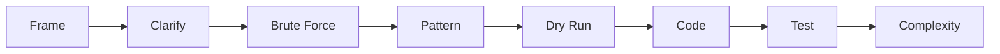

# Coding Round

## What This Means

Coding interviews test how you think, not only whether you memorize a solution. As a beginner, use the same flow every time.

1. Restate the problem.
2. Ask clarifying questions.
3. Explain brute force.
4. Pick a pattern.
5. Dry run with a small example.
6. Code clean Java.
7. Test edge cases.
8. Explain complexity.



## Interview Answer

> I will first clarify input size, duplicates, empty cases, and expected output. Then I will explain a brute-force approach, improve it using a known pattern, dry run the logic, write clean Java, and test edge cases before giving time and space complexity.

## Beginner Patterns

| Pattern | When To Use |
|---|---|
| Hash map/set | Fast lookup, counts, duplicates. |
| Two pointers | Sorted arrays, left/right movement. |
| Sliding window | Contiguous substring/subarray. |
| Stack | Matching parentheses, next greater item. |
| BFS/DFS | Trees, graphs, grids. |
| Heap | Top K or smallest/largest repeated access. |
| Dynamic programming | Repeated subproblems. |
| LinkedHashMap | LRU cache. |

## Problem 1: Merge Two Sorted Arrays In Place

### What This Means

You have two sorted arrays. The first has extra space at the end. Merge the second array into the first without using another large array.

### Tiny Example

Two sorted lines of people need to become one sorted line. Start from the tallest end so you do not overwrite people at the front.

### Pattern

Two pointers from the back.

### Dry Run

`nums1 = [1,2,3,0,0,0]`, `m = 3`, `nums2 = [2,5,6]`, `n = 3`.

Compare `3` and `6`, put `6` at the end. Then compare `3` and `5`, put `5`. Continue until merged.

```java
class Solution {
    public void merge(int[] nums1, int m, int[] nums2, int n) {
        int i = m - 1;
        int j = n - 1;
        int write = m + n - 1;

        while (j >= 0) {
            if (i >= 0 && nums1[i] > nums2[j]) {
                nums1[write--] = nums1[i--];
            } else {
                nums1[write--] = nums2[j--];
            }
        }
    }
}
```

### Complexity

Time is linear in total elements. Space is constant.

## Problem 2: Grid Paths With Blocked Cells

### What This Means

Count ways to move from top-left to bottom-right when some cells are blocked.

### Pattern

Dynamic programming.

```java
class Solution {
    public int uniquePathsWithObstacles(int[][] grid) {
        int rows = grid.length;
        int cols = grid[0].length;
        int[][] dp = new int[rows][cols];

        if (grid[0][0] == 1) return 0;
        dp[0][0] = 1;

        for (int r = 0; r < rows; r++) {
            for (int c = 0; c < cols; c++) {
                if (grid[r][c] == 1) {
                    dp[r][c] = 0;
                    continue;
                }
                if (r > 0) dp[r][c] += dp[r - 1][c];
                if (c > 0) dp[r][c] += dp[r][c - 1];
            }
        }

        return dp[rows - 1][cols - 1];
    }
}
```

### Visa/Payment Example

This teaches dependency thinking. A payment workflow also moves through steps where one failed step can block later steps.

## Problem 3: Best Time To Buy And Sell Stock

### What This Means

Find the maximum profit from one buy and one sell.

### Pattern

Track the minimum price seen so far.

```java
class Solution {
    public int maxProfit(int[] prices) {
        int minPrice = Integer.MAX_VALUE;
        int bestProfit = 0;

        for (int price : prices) {
            minPrice = Math.min(minPrice, price);
            bestProfit = Math.max(bestProfit, price - minPrice);
        }

        return bestProfit;
    }
}
```

### Complexity

One pass, constant space.

## Problem 4: First Recurring Character

### What This Means

Return the first character that appears twice as you scan left to right.

### Pattern

HashSet.

```java
class Solution {
    public Character firstRecurring(String input) {
        Set<Character> seen = new HashSet<>();
        for (char ch : input.toCharArray()) {
            if (seen.contains(ch)) return ch;
            seen.add(ch);
        }
        return null;
    }
}
```

## Problem 5: Top K Frequent Elements

### What This Means

Find the K numbers that appear most often.

### Pattern

HashMap for counts, PriorityQueue for top K.

```java
class Solution {
    public int[] topKFrequent(int[] nums, int k) {
        Map<Integer, Integer> count = new HashMap<>();
        for (int num : nums) count.put(num, count.getOrDefault(num, 0) + 1);

        PriorityQueue<Integer> heap = new PriorityQueue<>(
            Comparator.comparingInt(count::get)
        );

        for (int num : count.keySet()) {
            heap.offer(num);
            if (heap.size() > k) heap.poll();
        }

        int[] result = new int[k];
        for (int i = k - 1; i >= 0; i--) result[i] = heap.poll();
        return result;
    }
}
```

## Problem 6: Sliding Window Maximum

### What This Means

For every window of size `k`, return the largest value.

### Pattern

Deque storing useful indices.

```java
class Solution {
    public int[] maxSlidingWindow(int[] nums, int k) {
        Deque<Integer> deque = new ArrayDeque<>();
        int[] result = new int[nums.length - k + 1];
        int index = 0;

        for (int i = 0; i < nums.length; i++) {
            while (!deque.isEmpty() && deque.peekFirst() <= i - k) {
                deque.pollFirst();
            }
            while (!deque.isEmpty() && nums[deque.peekLast()] <= nums[i]) {
                deque.pollLast();
            }
            deque.offerLast(i);
            if (i >= k - 1) {
                result[index++] = nums[deque.peekFirst()];
            }
        }

        return result;
    }
}
```

## Problem 7: LRU Cache

### What This Means

Keep the most recently used items. Remove the least recently used item when full.

### Pattern

`LinkedHashMap` or HashMap plus doubly linked list.

```java
class LRUCache extends LinkedHashMap<Integer, Integer> {
    private final int capacity;

    public LRUCache(int capacity) {
        super(capacity, 0.75f, true);
        this.capacity = capacity;
    }

    public int get(int key) {
        return super.getOrDefault(key, -1);
    }

    public void put(int key, int value) {
        super.put(key, value);
    }

    @Override
    protected boolean removeEldestEntry(Map.Entry<Integer, Integer> eldest) {
        return size() > capacity;
    }
}
```

### Visa/Payment Example

Cache merchant configuration or token metadata, but always think about TTL and stale data.

## Problem 8: Trie Root Word Matching

### What This Means

Given dictionary roots, replace words with the shortest matching root.

### Pattern

Trie.

```java
class TrieNode {
    Map<Character, TrieNode> children = new HashMap<>();
    boolean isWord;
}

class Solution {
    private final TrieNode root = new TrieNode();

    public String replaceWords(List<String> dictionary, String sentence) {
        for (String word : dictionary) insert(word);

        StringBuilder result = new StringBuilder();
        for (String word : sentence.split(" ")) {
            if (result.length() > 0) result.append(" ");
            result.append(findRoot(word));
        }
        return result.toString();
    }

    private void insert(String word) {
        TrieNode node = root;
        for (char ch : word.toCharArray()) {
            node = node.children.computeIfAbsent(ch, c -> new TrieNode());
        }
        node.isWord = true;
    }

    private String findRoot(String word) {
        TrieNode node = root;
        StringBuilder prefix = new StringBuilder();
        for (char ch : word.toCharArray()) {
            if (!node.children.containsKey(ch)) return word;
            node = node.children.get(ch);
            prefix.append(ch);
            if (node.isWord) return prefix.toString();
        }
        return word;
    }
}
```

## Problem 9: Valid Parentheses With Wildcard

### What This Means

`*` can behave like `(`, `)`, or empty. Decide if the string can be valid.

### Pattern

Greedy range of possible open counts.

```java
class Solution {
    public boolean checkValidString(String s) {
        int minOpen = 0;
        int maxOpen = 0;

        for (char ch : s.toCharArray()) {
            if (ch == '(') {
                minOpen++;
                maxOpen++;
            } else if (ch == ')') {
                minOpen = Math.max(0, minOpen - 1);
                maxOpen--;
            } else {
                minOpen = Math.max(0, minOpen - 1);
                maxOpen++;
            }

            if (maxOpen < 0) return false;
        }

        return minOpen == 0;
    }
}
```

## Practice Questions

**Q: What should you do if you do not know the optimal solution?**

Start with brute force, explain why it works, then improve one bottleneck.

**Q: What edge cases should you always check?**

Empty input, one element, duplicates, sorted/reverse sorted data, impossible cases, and large values.

**Q: How should you explain complexity?**

Use plain English: "I scan the array once, so time is linear. I store at most n values, so space is linear."

## Common Mistakes

- Coding before a dry run.
- Ignoring null or empty cases.
- Overcomplicating Java syntax.
- Forgetting to say why the solution is correct.
