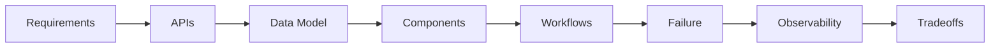
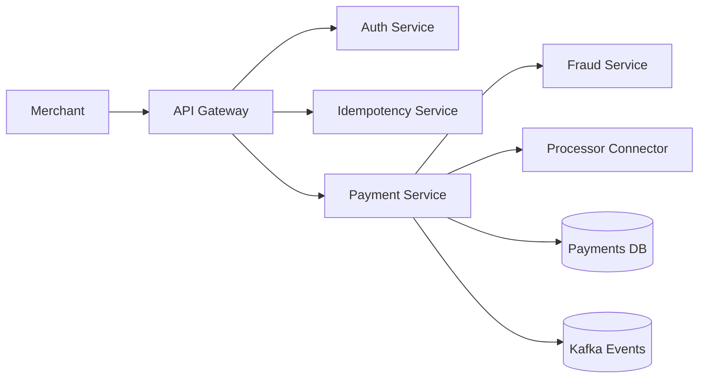
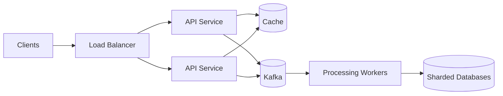
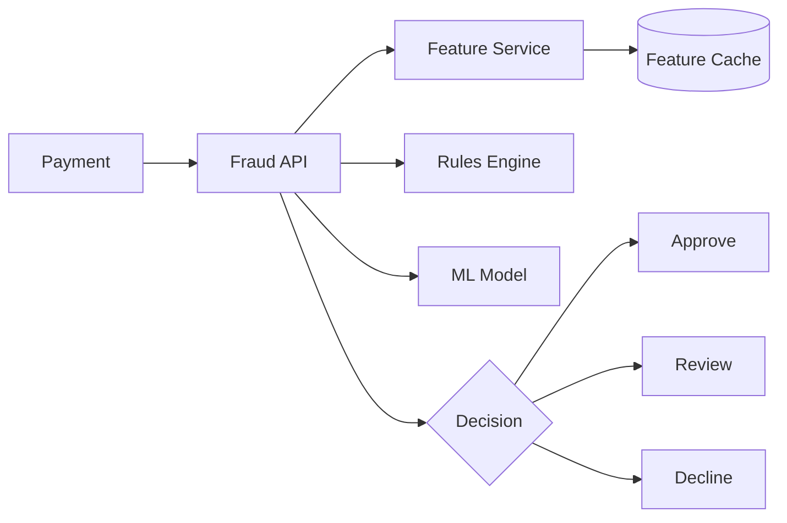
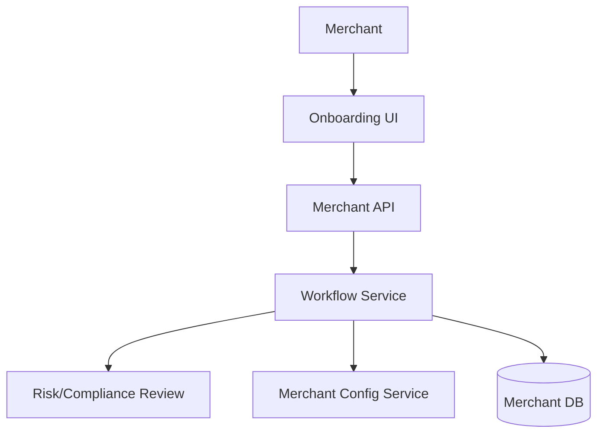
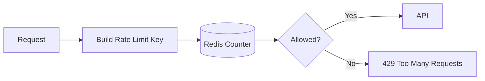
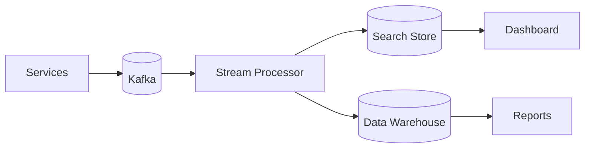
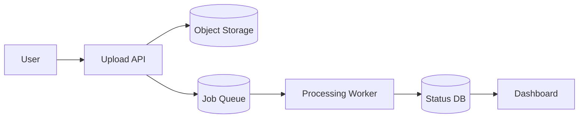

# HLD System Design

## What This Means

HLD means high-level design. You are not writing every class. You are designing the system: APIs, services, data storage, scale, failures, security, and observability.

## Beginner Template

Use this flow for every HLD question:

1. Requirements: what must the system do?
2. Non-functional requirements: scale, latency, availability, security.
3. APIs: how clients talk to the system.
4. Data model: what must be stored.
5. Components: services, database, cache, queue.
6. Core workflows: what happens step by step.
7. Failure modes: retries, timeouts, duplicates.
8. Observability: logs, metrics, traces, alerts.
9. Tradeoffs: what you chose and why.

## Payment Gateway

### What This Means

A payment gateway accepts payment requests from merchants and routes them to payment networks or processors.

### Visa/Payment Example

The gateway receives `POST /payments`, validates the request, checks idempotency, runs fraud checks, sends authorization, stores the result, and returns the decision.

### APIs

- `POST /payments/authorizations`
- `POST /payments/{id}/capture`
- `POST /payments/{id}/refund`
- `GET /payments/{id}`

### Data Model

`Payment(id, merchantId, amount, currency, status, idempotencyKey, createdAt)`

### Failure Modes

- Timeout after authorization: retry with idempotency key.
- Processor unavailable: return pending or fail depending on business rules.
- Duplicate request: return stored result.

### Interview Answer

> I would design a payment gateway with API gateway, auth, idempotency, payment orchestration, fraud/risk checks, processor connector, durable payment database, and event publishing. The critical parts are safe retries, duplicate prevention, audit logs, security, and strong metrics around latency, approval rate, error rate, and processor failures.

## Millions Of Transactions Per Second

### Beginner Explanation

At very high scale, one server and one database will not work. You split traffic horizontally and avoid putting every request through a single bottleneck.

### Key Ideas

- Stateless services scale horizontally.
- Partition events by `merchantId` or `paymentId`.
- Use caches for reference data.
- Use sharded databases for write scale.
- Use backpressure when downstream systems slow down.

### Interview Answer

> I would separate the synchronous authorization path from asynchronous enrichment and reporting. The critical path must be small, horizontally scalable, and protected by idempotency and rate limits. High-volume events go to Kafka, partitioned by stable keys, then workers process them into sharded storage and analytics systems.

## Real-Time Fraud Detection Service

### What This Means

Fraud detection scores a transaction before approval or shortly after receiving transaction events.

### Data Model

`FraudDecision(paymentId, score, reasonCodes, action, modelVersion, createdAt)`

### Failure Modes

- If fraud service times out, choose fail-open or fail-closed based on risk.
- If feature cache is stale, use fallback features or lower confidence.

### Interview Answer

> I would keep fraud scoring low-latency by precomputing features, caching merchant/card patterns, and using a rules engine plus model scoring. Every decision should include reason codes, model version, and audit fields so teams can explain and improve outcomes.

## Merchant Onboarding Platform

### What This Means

Merchants submit business details, documents, bank data, and configuration before they can process payments.

### APIs

- `POST /merchants`
- `PATCH /merchants/{id}`
- `POST /merchants/{id}/submit`
- `GET /merchants/{id}/status`

### Interview Answer

> I would model merchant onboarding as a workflow with states like draft, submitted, under review, approved, rejected, and active. The platform needs validation, document storage, audit logs, role-based access, notifications, and clear status APIs for the UI.

## Payment API Rate Limiter

### What This Means

A rate limiter protects APIs from overload or abuse by limiting requests per merchant, user, or IP.

### Interview Answer

> I would use Redis for distributed counters and rate limit by merchant plus endpoint. The system should return 429 with retry information, emit metrics, and allow configurable limits for trusted partners.

## Transaction Monitoring And Logging Pipeline

### What This Means

This system collects transaction events so teams can debug, monitor, audit, and analyze behavior.

### Interview Answer

> I would emit structured events from every payment step, send them through Kafka, process them into searchable logs and analytics storage, and build dashboards for latency, error rate, approval rate, duplicate requests, and downstream failures.

## Notification And Receipt Service

### Key Design

- Receives events such as `PaymentCaptured`.
- Looks up notification preferences.
- Sends email/SMS/webhook.
- Retries failures with exponential backoff.
- Uses idempotency to avoid duplicate receipts.

## Monolith Scaling To 3x Traffic

### Beginner Plan

1. Measure bottlenecks first.
2. Add cache for expensive reads.
3. Add database indexes.
4. Move slow async work to a queue.
5. Horizontally scale stateless app servers.
6. Add observability before and after.

### Interview Answer

> I would not split the monolith immediately. I would first measure bottlenecks, cache stable reference data, optimize database queries and indexes, move slow tasks async, and horizontally scale stateless nodes. Then I would extract services only around clear ownership boundaries.

## Upload/Download Processing With Real-Time Dashboard

### Design

### Interview Answer

> I would upload files to object storage, create a processing job, process asynchronously with workers, and expose job status to a dashboard. For reliability I would use retries, dead-letter queues, file validation, progress metrics, and clear failure states.

## Practice Questions

**Q: What is the first thing to ask in HLD?**

Clarify requirements, users, scale, latency, consistency, security, and failure behavior.

**Q: Why use Kafka in payment systems?**

To decouple services and process audit, fraud, notifications, and analytics without slowing the core payment response.

**Q: What metrics matter for a payment gateway?**

Authorization latency, approval rate, decline rate, timeout rate, duplicate request rate, downstream error rate, and p95/p99 latency.

## Common Mistakes

- Drawing boxes without explaining data flow.
- Forgetting idempotency.
- Ignoring fraud, audit, and security.
- Saying "use microservices" without boundaries.
- Not explaining what happens on timeout.
