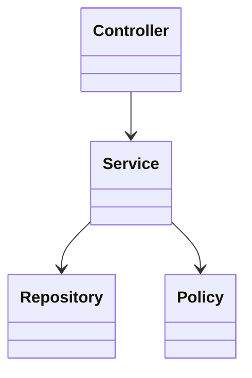
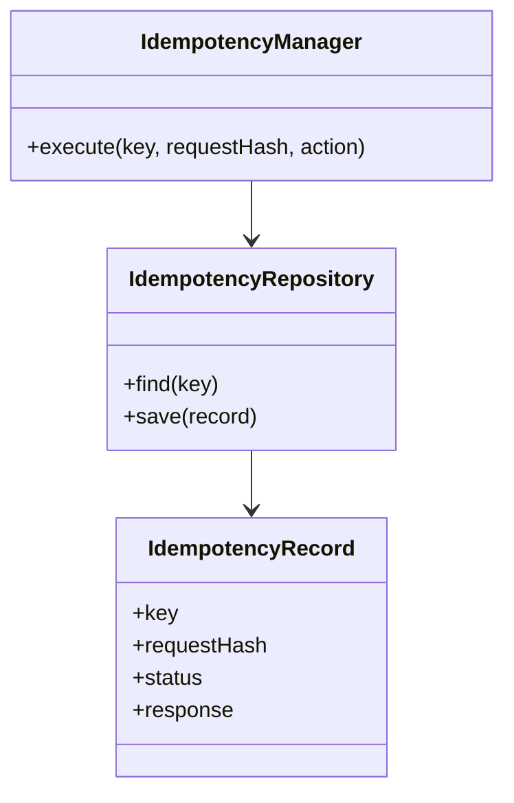
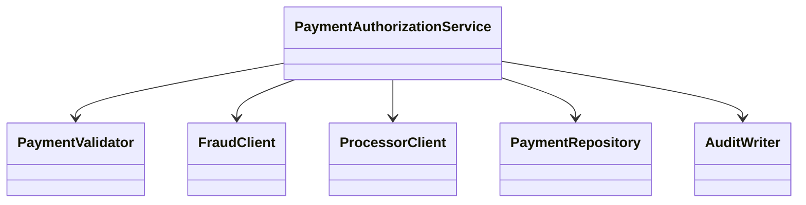
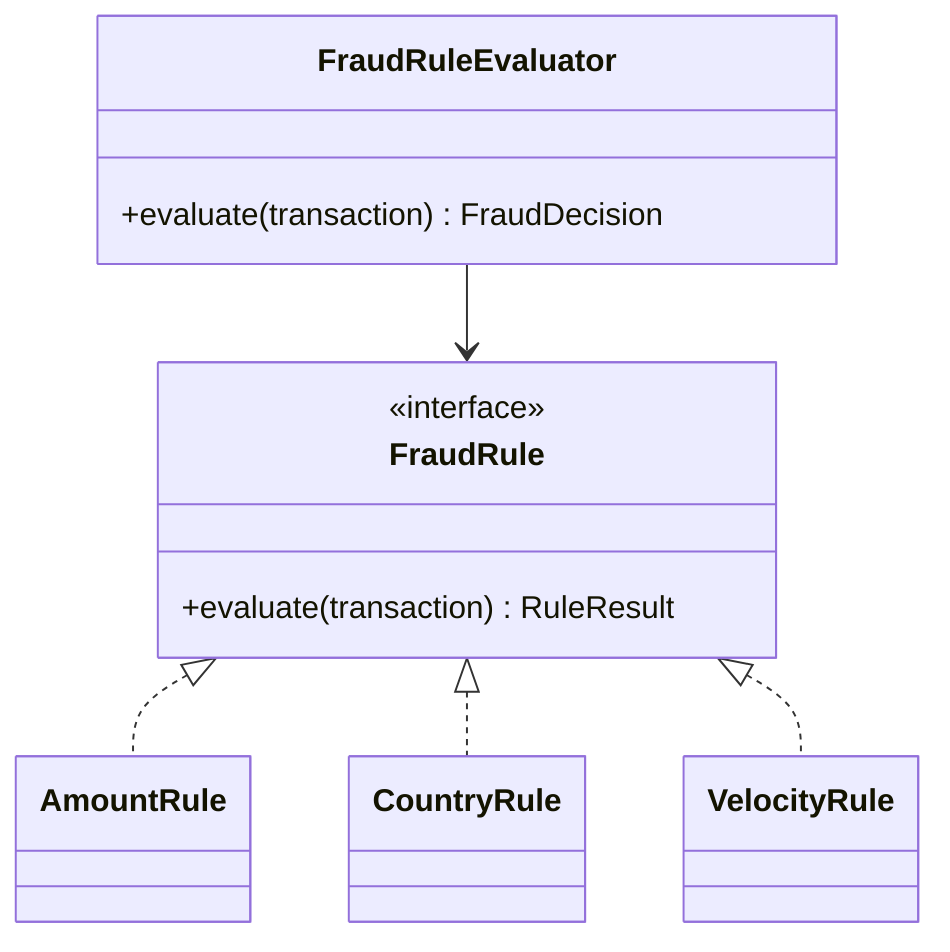
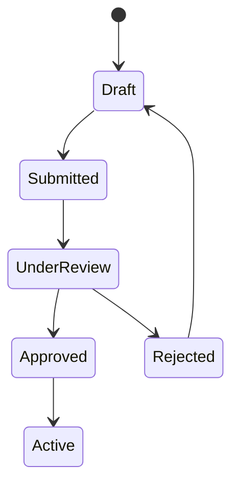

# LLD Design

## What This Means

LLD means low-level design. You design classes, interfaces, responsibilities, data structures, and tests. You should show clean object-oriented thinking.

## Beginner Template

Use this structure:

1. Define the goal.
2. List requirements.
3. Identify entities.
4. Create interfaces.
5. Create services.
6. Name invariants.
7. Discuss concurrency.
8. Write tests.



## Idempotency Key Manager

### What This Means

This prevents duplicate processing when the same request is retried.

### Class Diagram



### Java Skeleton

```java
class IdempotencyManager {
    private final IdempotencyRepository repository;

    Response execute(String key, String requestHash, Supplier<Response> action) {
        Optional<IdempotencyRecord> existing = repository.find(key);
        if (existing.isPresent()) {
            IdempotencyRecord record = existing.get();
            if (!record.requestHash().equals(requestHash)) {
                throw new IllegalArgumentException("Same key with different request");
            }
            return record.response();
        }

        Response response = action.get();
        repository.save(new IdempotencyRecord(key, requestHash, "COMPLETED", response));
        return response;
    }
}
```

### Tests

- First request processes action.
- Same key and same request returns saved response.
- Same key and different request fails.
- Concurrent same-key requests do not both process.

## Payment Authorization Workflow

### Object Model

| Class | Responsibility |
|---|---|
| `PaymentAuthorizationService` | Orchestrates validation, fraud, processor call, and persistence. |
| `PaymentValidator` | Checks required fields and amount/currency rules. |
| `FraudClient` | Gets risk decision. |
| `ProcessorClient` | Calls external authorization processor. |
| `PaymentRepository` | Stores payment state. |
| `AuditWriter` | Records decisions. |



### Invariant

A payment cannot be both `APPROVED` and `DECLINED`.

## Transaction Retry Processor

### What This Means

Some operations fail temporarily. A retry processor retries safe work without overwhelming downstream systems.

### Java Skeleton

```java
class RetryPolicy {
    boolean shouldRetry(int attempt, Throwable error) {
        return attempt < 3 && isTemporary(error);
    }

    long nextDelayMillis(int attempt) {
        return (long) Math.pow(2, attempt) * 1000;
    }

    private boolean isTemporary(Throwable error) {
        return error instanceof TimeoutException;
    }
}
```

### Edge Cases

- Permanent failure should not retry forever.
- Duplicate jobs should be idempotent.
- Failed retries should go to a dead-letter queue.

## Fraud Rule Evaluator

### What This Means

A rule evaluator checks a transaction against configurable rules.



### Interview Answer

> I would model each fraud rule as an interface implementation so new rules can be added without changing the evaluator. The evaluator combines rule results into a decision like approve, review, or decline, and records reason codes for auditability.

## API Rate Limiter

### Token Bucket Explanation

A bucket has tokens. Each request uses one token. Tokens refill over time. If the bucket is empty, reject the request.

```java
class TokenBucket {
    private final int capacity;
    private final int refillPerSecond;
    private double tokens;
    private long lastRefillNanos;

    synchronized boolean allow() {
        refill();
        if (tokens < 1) return false;
        tokens -= 1;
        return true;
    }

    private void refill() {
        long now = System.nanoTime();
        double seconds = (now - lastRefillNanos) / 1_000_000_000.0;
        tokens = Math.min(capacity, tokens + seconds * refillPerSecond);
        lastRefillNanos = now;
    }
}
```

### Tests

- Allows requests while tokens exist.
- Rejects when empty.
- Allows again after refill.
- Handles concurrent calls safely.

## LRU Cache

### Plain English

When the cache is full, remove the item that has not been used for the longest time.

### Best Java Shortcut

Use `LinkedHashMap` with access-order enabled.

### Tests

- `get` returns value and updates recency.
- `put` updates existing key.
- New key over capacity evicts least recently used key.

## Merchant Onboarding State Machine

### States



### Invariant

A merchant cannot become `Active` before approval.

### Interview Answer

> I would use an explicit state machine so allowed transitions are clear and invalid transitions are rejected. This makes onboarding safer, easier to test, and easier to audit.

## Audit Event Writer

### What This Means

Audit events record who did what, when, and why.

### Object Model

| Class | Responsibility |
|---|---|
| `AuditEvent` | Immutable event payload. |
| `AuditWriter` | Validates and writes events. |
| `AuditRepository` | Persists events. |
| `Clock` | Supplies testable time. |

### Java Skeleton

```java
record AuditEvent(
    String id,
    String actor,
    String action,
    String resourceId,
    Instant occurredAt
) {}

class AuditWriter {
    private final AuditRepository repository;
    private final Clock clock;

    void record(String actor, String action, String resourceId) {
        AuditEvent event = new AuditEvent(
            UUID.randomUUID().toString(),
            actor,
            action,
            resourceId,
            Instant.now(clock)
        );
        repository.save(event);
    }
}
```

## Practice Questions

**Q: What is an invariant?**

A rule that must always remain true, such as "one idempotency key maps to one request result."

**Q: Why use interfaces?**

Interfaces make behavior replaceable and testable. For example, a `FraudClient` can be mocked in tests.

**Q: What should you mention for concurrency?**

Name what can race, which operation must be atomic, and how you would lock or use database constraints.

## Common Mistakes

- Creating too many classes without clear responsibilities.
- Forgetting tests.
- Ignoring concurrency.
- Not naming invariants.
- Hiding business rules inside random helper methods.
