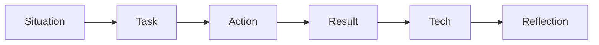

# Behavioral and Hiring Manager

## What This Means

Behavioral interviews check how you work with people, ambiguity, pressure, and ownership. Hiring manager interviews also check whether your experience fits the role.

Use STAR+TECH:

| Part | What To Say |
|---|---|
| Situation | What was happening? |
| Task | What were you responsible for? |
| Action | What did you personally do? |
| Result | What changed, with numbers if possible? |
| Tech | What architecture/design choices mattered? |
| Reflection | What did you learn? |

## Why Visa?

### Beginner Explanation

This answer should connect your skills to Visa's mission and scale.

### Interview Answer

> I am interested in Visa because the work sits at the intersection of fullstack product engineering, scalable backend systems, security, and global payments. My experience with React/TypeScript, Java APIs, observability, OAuth/OIDC, Kafka, and high-impact onboarding workflows maps well to building reliable services and web applications that support merchants, partners, and payment flows at scale.

## Story 1: AWS Partner Central Onboarding

### Situation

AWS Partner Central needed better onboarding modules for partner activation.

### Task

You worked on React, TypeScript, Next.js micro-frontend modules and Java REST APIs.

### Action

Explain that you built UI modules, connected backend activation APIs, and improved onboarding visibility.

### Result

Improved onboarding across 500+ partner accounts and unblocked activation tied to $2M+ in annualized revenue pipeline.

### Visa Angle

Merchant onboarding at Visa has similar needs: clear UI, reliable APIs, status visibility, and business impact.

### Interview Answer

> At AWS, I helped build Partner Central onboarding using React, TypeScript, Next.js, and Java APIs. The work improved onboarding across 500+ partner accounts and supported activation tied to $2M+ in revenue pipeline. The Visa connection is merchant and partner enablement: I understand how to build fullstack workflows where user experience, backend reliability, metrics, and business outcomes all matter.

## Story 2: Playwright CI/CD Release-Time Reduction

### Situation

Manual regression work slowed releases and allowed UI breakages.

### Action

You established Playwright integration test coverage for CI/CD validation and monitoring.

### Result

Release validation time dropped from 45 minutes to 8 minutes.

### Visa Angle

Payment and merchant platforms need high confidence releases because breakages can block business workflows.

## Story 3: Java REST APIs And CloudWatch Metrics

### Situation

Partner activation flows needed lifecycle orchestration and observability.

### Action

You built Java REST APIs with Guice, emitted 20+ CloudWatch metrics, and automated dynamic email generation for 3 activation flows.

### Visa Angle

This maps to payment APIs, merchant workflows, event visibility, and operational metrics.

## Story 4: Amazon Q Answer Cards

### Result

Deflected 300+ support questions per month and reduced time-to-answer from 4 minutes to under 30 seconds.

### Visa Angle

This shows user empathy and product thinking. For Visa, better internal or merchant guidance can reduce support load and speed partner success.

## Story 5: RUM-Based Incident Triage

### Situation

Frontend incidents needed user-session context.

### Action

You designed AI-assisted incident triage with RUM logs and attached trace context to alerts.

### Result

Cut duplicate incident escalations by 30+ per quarter.

### Visa Angle

This is strong for observability and production maturity. Payment systems need fast detection, clear context, and reduced noise.

## Story 6: Philips OAuth/OIDC Integration

### Situation

Authentication support issues affected users.

### Action

You integrated Spring Boot services with external OAuth 2.0/OIDC providers.

### Result

Reduced authentication-related support issues by 20+ per month.

### Visa Angle

This maps directly to secure APIs, identity, and authorization in fullstack products.

## Story 7: Kafka/MongoDB Event Pipeline

### Situation

Real-time data workflows needed better throughput.

### Action

You built Java, Kafka, and MongoDB event-driven processing pipelines.

### Result

Scaled real-time data throughput by 3x.

### Visa Angle

This is relevant to payment events, fraud signals, audit streams, and transaction monitoring.

## Story 8: Volkswagen SQL Optimization

### Situation

Complex SQL queries were slow.

### Action

You optimized queries and improved data access patterns.

### Result

Reduced execution time by 80% and supported 5000+ transactions per second.

### Visa Angle

This is a direct scale story. Use it when asked about performance, databases, or transaction-heavy systems.

## Common Questions And Answers

### Tell Me About Your Current Architecture And Role

> I work on fullstack partner-facing workflows using React, TypeScript, Next.js, and Java REST APIs. My role includes building UI modules, backend APIs, observability metrics, testing with Playwright, and improving production support through RUM-based incident triage. I focus on reliable user workflows, measurable impact, and reducing operational friction.

### Tell Me About A React Feature You Built

> I built React/TypeScript micro-frontend modules for AWS Partner Central onboarding. I focused on reusable components, API integration, clear loading/error states, and test coverage with Playwright so partner activation workflows were reliable and easier to release.

### Tell Me About A Production Issue

> I worked on incident triage using RUM logs to attach user-session context to alerts. The goal was to make alerts more actionable and reduce duplicate escalations. The result was 30+ fewer duplicate escalations per quarter, and the lesson was that good observability should tell engineers what user journey failed, not just that an error happened.

### Tell Me About Disagreement Or Conflict

> I handle disagreement by aligning on the user impact and objective metrics first. For example, if there is debate about whether to prioritize release speed or test coverage, I compare failure risk, release frequency, and maintenance cost. Once the team decides, I commit to the chosen direction and help make it successful.

### How Do You Handle Ambiguity?

> I turn ambiguity into explicit assumptions. I clarify the goal, identify unknowns, choose a reversible first step, and validate with metrics or user feedback. In onboarding workflows, this means defining the state model, API contract, and success metric before building too much UI.

### How Do You Balance Speed, Quality, And Security?

> I move fast on reversible UI and workflow improvements, but I am careful around security, data correctness, and payment-like flows. For critical paths I want validation, idempotency, logging, tests, and rollback plans before release. That balance lets the team ship without creating hidden operational risk.

## Practice Questions

**Q: What story should you use for quality improvement?**

Use Playwright CI/CD coverage and release-time reduction.

**Q: What story should you use for security?**

Use Philips OAuth/OIDC integration or JWT/OAuth work from IOO Labs.

**Q: What story should you use for scale?**

Use Volkswagen SQL optimization or Philips Kafka pipeline.

**Q: What story should you use for production maturity?**

Use RUM-based incident triage.

## Common Mistakes

- Giving a long background before answering the question.
- Saying "we" without explaining your personal contribution.
- Forgetting measurable impact.
- Not connecting the story back to Visa's role.
- Overusing buzzwords without explaining the concrete work.
