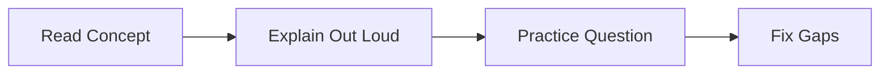

# 7-Day Study Plan

## What This Means

This plan is for getting started quickly while still building real understanding. Do not try to memorize everything in one pass. Read, explain out loud, then practice.

## Daily Format

## Day 1: Payments Foundation

- Read `Visa and Payments Basics`.
- Draw the card payment flow from memory.
- Explain authorization, capture, refund, void, tokenization, and idempotency.
- Practice: "Explain how a card payment works."

## Day 2: Java, REST, Databases

- Read Java, REST, and database sections.
- Practice HashMap, HashSet, arrays, and two pointers.
- Explain SQL vs NoSQL and indexes.
- Practice: merge two sorted arrays and first recurring character.

## Day 3: Kafka, Caching, Security, Observability

- Read Kafka, caching, security, and observability.
- Explain producer, consumer, topic, partition, and offset.
- Explain OAuth/OIDC, JWT, authentication, and authorization.
- Practice: "How would you debug a payment API latency spike?"

## Day 4: Coding Round

- Solve three problems:
  - best time to buy/sell stock
  - top K frequent elements
  - sliding window maximum
- Speak the framework out loud.
- Write edge cases before code.

## Day 5: HLD System Design

- Study payment gateway.
- Study fraud detection.
- Study merchant onboarding.
- Practice one 30-minute design: "Design a scalable payment gateway."

## Day 6: LLD Design

- Study idempotency key manager.
- Study rate limiter.
- Study merchant onboarding state machine.
- Practice one 30-minute LLD: "Design idempotency for a payment API."

## Day 7: Behavioral And Mock Loop

- Prepare 5 stories:
  - onboarding impact
  - Playwright release improvement
  - Java APIs and metrics
  - OAuth/OIDC security
  - incident triage
- Do one coding question.
- Do one HLD question.
- Record weak spots.

## Readiness Checklist

You are ready for a first mock when you can:

- Explain a payment authorization flow without notes.
- Solve easy/medium Java problems with a dry run.
- Design a payment gateway at a high level.
- Design idempotency or rate limiting at a class level.
- Tell five resume stories in under two minutes each.

## Common Mistakes

- Reading passively without speaking.
- Studying only coding and ignoring system design.
- Studying only concepts and never writing Java.
- Not preparing resume stories.
